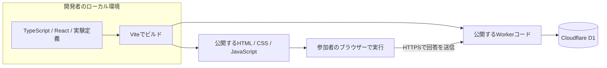

# jsPsych-demo

Demo site for a web development talk using jsPsych.

ReactとjsPsychによる、小規模ウェブ実験の開発デモです。
「同じ提案でも、希望を理解したことを示す一言によって、理解された感覚は変わるか」を題材にします。

**被験者間2群・4場面の実験、逐次保存、24時間以内の再開、CSV取得を実装しました。**
公開先は合成データによる技術検証用です。実参加者の募集・研究実施の承認を意味しません。
計画の基準日: 2026-09-11。

## 実験デモを動かす

公開サイト: <https://jspsych-demo-staging.jspsych-demo.workers.dev/>

Devboxを使って、ローカルのNode.js・Worker・D1を準備します。

```sh
devbox install
devbox run setup
devbox run dev
```

ブラウザーで`http://127.0.0.1:5173/`を開きます。
説明への同意後、4つの場面について理解感・有用性を各1〜7で評価します。各場面のDB保存確認後に次へ進み、4件の保存で完了します。
ローカルD1と公開D1は別のデータベースです。
検証・再デプロイ・CSV取得は[実験デモの運用手順](docs/study-deployment.md)を参照してください。
既存の[Hello World](https://jspsych-demo-hello.jspsych-demo.workers.dev/)は変更せず残しています。旧手順は[履歴資料](docs/deployment.md)です。

```sh
devbox run check
devbox run -- npm run test:api       # ローカルサーバー起動中
devbox run -- npm run test:e2e       # Chromeを使用
devbox run -- npm run db:migrate:demo
devbox run -- npm run deploy:demo
devbox run -- npm run data:export -- --target demo --output exports/demo
```

CSVは `demo.completed-trials.csv`、`demo.incomplete-trials.csv`、`demo.sessions.csv`、`demo.metadata.json` の4ファイルです。既存ファイルは上書きしません。

## 目的

小規模研究として説明できる実験を実装し、ブラウザー、サーバー、開発者のローカルビルド環境の役割を参照できるコードベースを作ります。
参加者には通常の実験説明・同意・課題・簡素な完了画面を提示します。
講演資料、スライド、進行台本、参加者向けの技術解説画面は今回の対象外です。

## 合意した要件

以下の技術要件を実験デモに反映しています。研究上の承認・必要人数・募集条件は別途確定が必要です。

| 項目 | 方針 |
| --- | --- |
| 題材 | 休日の過ごし方。場面ごとに希望を指定する |
| 比較 | 提案は同じにし、前置きを「希望の理解を示す / 中立な案内」に変える |
| 実験計画 | 参加者ごとに各50%の確率で2群へ単純無作為割り当てする被験者間計画 |
| 時間 | 説明・同意・回答を含め約5分。デモと研究想定で共通の流れ |
| 測定 | 理解された感覚と有用性、各7段階 |
| 想定規模 | オンライン募集を想定、PCのChromeのみ動作保証、総数100〜500名程度 |
| 応答 | 事前作成した固定文章。生成AIには接続しない |
| 技術 | TypeScript、React、jsPsych、Vite、Cloudflare Workers、D1 |
| 保存 | 場面ごとに送信し、保存成功後に次へ進む。失敗時は手動再送。4回答のDB保存で自動完了。ランダム参加IDを使用 |
| 再開 | 同じブラウザー・同じ公開URL・同じ仕様の運用中に、開始から24時間以内。参加途中の仕様更新は想定外 |
| 保持 | デモのサーバーデータは作成から30日。期限切れを自動削除 |
| 取得 | 開発者が完了試行CSV・未完了試行CSV・全セッションCSV・抽出メタデータの4ファイルを固定出力。独自の管理画面は作らない |
| 環境 | ローカルと合成データ用の公開Worker/D1を1組。無料枠を中心に構成する |

場面数は**1人4場面、全場面で割り当てられた同一条件**とします。両群に共通のS01〜S04を用い、提示順だけをランダム化する設計案です。群の人数を厳密に揃える処理は設けず、再開時も群と提示順を維持します。約5分という時間目安は、場面削減後の予備実施で見直します。
100〜500名は運用上の想定範囲であり、検出力を確認済みの必要人数ではありません。ローカルでは追加検証として500完了セッション・2,000試行の合成データをCSVと照合しました。公開環境での同時利用・性能保証ではありません。

## 計画ドキュメント

| ファイル | 内容 |
| --- | --- |
| [開発・デプロイ手順](docs/deployment.md) | 実装済みHello WorldのDevbox環境、起動、公開、DB確認、検証結果 |
| [実験デモの運用手順](docs/study-deployment.md) | 現行の起動・公開・CSV・受付停止・保持期限 |
| [実装検証記録](docs/implementation-verification.md) | 実行環境、検証結果、Reviewer指摘と対応、残る運用確認 |
| [受け入れ基準](docs/acceptance-criteria.md) | 監査で確定した仕様、合否の判定方法、対象外と未検証事項 |
| [研究計画](docs/research-plan.md) | 仮説、刺激案、割り当て、評価、分析方針、研究実施前の未確定事項 |
| [アーキテクチャ](docs/architecture.md) | 実行場所、ビルド、React/jsPsychの境界、公開構成、技術選定の理由 |
| [データと再開の契約](docs/data-contract.md) | API、DB、逐次保存、重複防止、再開、保持期限、CSV |
| [実装計画](docs/implementation-plan.md) | 開発段階、予定ファイル、検証項目、完成条件、公開前の確認 |

## 実装後の構成



ReactとjsPsychは参加者のブラウザーで動きます。
APIは公開後にはCloudflareのWorkersランタイムで動きます。
Node.js、npm、Viteは主に開発・ビルド用で、参加者のPCにインストールするものではありません。
具体的な技術的根拠は[アーキテクチャの公式資料](docs/architecture.md#公式資料)を参照してください。

## 完成範囲と研究準備

実装は `docs` の最終精査（`ddd765b`）に従います。公開URLでの4場面・保存・通常再開・CSV照合と、ローカルの障害・期限削除の確認結果は[実装検証記録](docs/implementation-verification.md)にまとめます。公開Cronの設定確認と実行成功確認は区別します。

実装が動くことと、参加者募集を始められることは別です。
研究責任者、連絡先、説明・同意文、募集条件などは[研究計画の公開前確認](docs/research-plan.md#公開前に確定する事項)に残しています。

## ライセンス

コードのライセンスは[MIT License](LICENSE)です。
収集する回答データを公開リポジトリやコードのライセンス対象へ自動的に含めることはしません。
