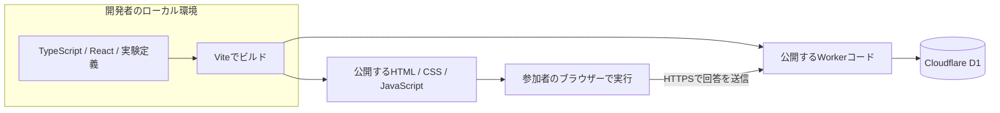

# jsPsych-demo

Demo site for a web development talk using jsPsych.

ReactとjsPsychによる、小規模ウェブ実験の開発デモです。
「同じ提案でも、希望を理解したことを示す一言によって、理解された感覚は変わるか」を題材にします。

**現在は実装計画の段階です。アプリ、API、データベース、実行コマンドはまだ実装していません。**
計画の基準日: 2026-09-11。

## 目的

小規模研究として説明できる実験を実装し、ブラウザー、サーバー、開発者のローカルビルド環境の役割を参照できるコードベースを作ります。
参加者には通常の実験説明・同意・課題・簡素な完了画面を提示します。
講演資料、スライド、進行台本、参加者向けの技術解説画面は今回の対象外です。

## 合意した要件

| 項目 | 方針 |
| --- | --- |
| 題材 | 休日の過ごし方。場面ごとに希望を指定する |
| 比較 | 提案は同じにし、前置きを「希望の理解を示す / 中立な案内」に変える |
| 実験計画 | 参加者ごとに各50%の確率で2群へ単純無作為割り当てする被験者間計画 |
| 時間 | 説明・同意・回答を含め約5分。デモと研究想定で共通の流れ |
| 測定 | 理解された感覚と有用性、各7段階 |
| 想定規模 | オンライン募集、PC限定、100〜500名程度 |
| 応答 | 事前作成した固定文章。生成AIには接続しない |
| 技術 | TypeScript、React、jsPsych、Vite、Cloudflare Workers、D1 |
| 保存 | 場面ごとの逐次送信。ランダム参加IDを使用 |
| 再開 | 同じブラウザー・同じ公開URLで、開始から24時間以内 |
| 保持 | デモのサーバーデータは作成から30日。期限切れを自動削除 |
| 取得 | 開発者がコマンドでCSVを出力。独自の管理画面は作らない |
| 環境 | ローカルと公開環境の両方。無料枠を中心に構成する |

場面数は**1人4場面、全場面で割り当てられた同一条件**とします。両群に共通のS01〜S04を用い、提示順だけをランダム化する設計案です。群の人数を厳密に揃える処理は設けず、再開時も群と提示順を維持します。約5分という時間目安は、場面削減後の予備実施で見直します。
100〜500名は運用上の想定範囲であり、検出力を確認済みの必要人数ではありません。

## 計画ドキュメント

| ファイル | 内容 |
| --- | --- |
| [研究計画](docs/research-plan.md) | 仮説、刺激案、割り当て、評価、分析方針、研究実施前の未確定事項 |
| [アーキテクチャ](docs/architecture.md) | 実行場所、ビルド、React/jsPsychの境界、公開構成、技術選定の理由 |
| [データと再開の契約](docs/data-contract.md) | API、DB、逐次保存、重複防止、再開、保持期限、CSV |
| [実装計画](docs/implementation-plan.md) | 開発段階、予定ファイル、検証項目、完成条件、公開前の確認 |

## 実装後の構成

ReactとjsPsychは参加者のブラウザーで動きます。
APIは公開後にはCloudflareのWorkersランタイムで動きます。
Node.js、npm、Viteは主に開発・ビルド用で、参加者のPCにインストールするものではありません。
具体的な技術的根拠は[アーキテクチャの公式資料](docs/architecture.md#公式資料)を参照してください。

## 次の開発段階

[実装計画のP0](docs/implementation-plan.md#p0-プロジェクトと実行環境)から着手します。
まずローカルで画面配信・API・ローカルD1の接続を確認し、その後に実験と再開処理を組み込みます。
現時点で実行可能な`npm`スクリプトや公開URLはありません。

実装が動くことと、参加者募集を始められることは別です。
研究責任者、連絡先、説明・同意文、募集条件などは[研究計画の公開前確認](docs/research-plan.md#公開前に確定する事項)に残しています。

## ライセンス

コードのライセンスは[MIT License](LICENSE)です。
収集する回答データを公開リポジトリやコードのライセンス対象へ自動的に含めることはしません。
