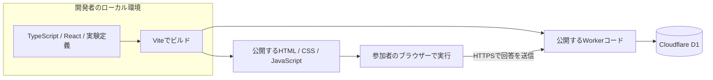

# jsPsych-demo

Demo site for a web development talk using jsPsych.

ReactとjsPsychによる、小規模ウェブ実験の開発デモです。
「同じ提案でも、希望を理解したことを示す一言によって、理解された感覚は変わるか」を題材にします。

**React・jsPsych・Workers API・D1を接続したFull-stack Hello Worldを実装し、Cloudflareへデプロイしました。**
研究計画の実験条件・複数場面・途中再開などは今後の実装対象です。
計画の基準日: 2026-09-11。

## Hello Worldを動かす

公開サイト: <https://jspsych-demo-hello.jspsych-demo.workers.dev/>

Devboxを使って、ローカルのNode.js・Worker・D1を準備します。

```sh
devbox install
devbox run setup
devbox run dev
```

ブラウザーで`http://127.0.0.1:5173/`を開きます。
開始後の「こんにちは」がjsPsychの試行です。回答と反応時間をAPIへ送り、D1への保存確認後に完了画面を表示します。
ローカルD1と公開D1は別のデータベースです。
検証・再デプロイ・DB確認は[Hello Worldの開発・デプロイ手順](docs/deployment.md)を参照してください。

## 目的

小規模研究として説明できる実験を実装し、ブラウザー、サーバー、開発者のローカルビルド環境の役割を参照できるコードベースを作ります。
参加者には通常の実験説明・同意・課題・簡素な完了画面を提示します。
講演資料、スライド、進行台本、参加者向けの技術解説画面は今回の対象外です。

## 合意した要件

以下は本実験に向けた計画です。現在のHello Worldは、技術構成を確認する1試行のデモです。

| 項目 | 方針 |
| --- | --- |
| 題材 | 休日の過ごし方。場面ごとに希望を指定する |
| 比較 | 提案は同じにし、前置きを「希望の理解を示す / 中立な案内」に変える |
| 実験計画 | 参加者ごとに各50%の確率で2群へ単純無作為割り当てする被験者間計画 |
| 時間 | 説明・同意・回答を含め約5分。デモと研究想定で共通の流れ |
| 測定 | 理解された感覚と有用性、各7段階 |
| 想定規模 | オンライン募集を想定、PCのChromeのみ動作保証、総数100〜500名程度 |
| 応答 | 事前作成した固定文章。生成AIには接続しない |
| 技術 | TypeScript、React、jsPsych、Vite、Cloudflare Workers、D1 |
| 保存 | 場面ごとの逐次送信。失敗時は手動再送。4回答のDB保存で自動完了。ランダム参加IDを使用 |
| 再開 | 同じブラウザー・同じ公開URL・同じ仕様の運用中に、開始から24時間以内。参加途中の仕様更新は想定外 |
| 保持 | デモのサーバーデータは作成から30日。期限切れを自動削除 |
| 取得 | 開発者が試行CSVと0回答を含むセッションCSVを出力。独自の管理画面は作らない |
| 環境 | ローカルと合成データ用の公開Worker/D1を1組。無料枠を中心に構成する |

場面数は**1人4場面、全場面で割り当てられた同一条件**とします。両群に共通のS01〜S04を用い、提示順だけをランダム化する設計案です。群の人数を厳密に揃える処理は設けず、再開時も群と提示順を維持します。約5分という時間目安は、場面削減後の予備実施で見直します。
100〜500名は運用上の想定範囲であり、検出力を確認済みの必要人数ではありません。今回の取得検証は少数の代表例を対象とし、500件規模の取得確認は将来の運用前に行います。

## 計画ドキュメント

| ファイル | 内容 |
| --- | --- |
| [開発・デプロイ手順](docs/deployment.md) | 実装済みHello WorldのDevbox環境、起動、公開、DB確認、検証結果 |
| [受け入れ基準](docs/acceptance-criteria.md) | 監査で確定した仕様、合否の判定方法、対象外と未検証事項 |
| [研究計画](docs/research-plan.md) | 仮説、刺激案、割り当て、評価、分析方針、研究実施前の未確定事項 |
| [アーキテクチャ](docs/architecture.md) | 実行場所、ビルド、React/jsPsychの境界、公開構成、技術選定の理由 |
| [データと再開の契約](docs/data-contract.md) | API、DB、逐次保存、重複防止、再開、保持期限、CSV |
| [実装計画](docs/implementation-plan.md) | 開発段階、予定ファイル、検証項目、完成条件、公開前の確認 |

## 実装後の構成



ReactとjsPsychは参加者のブラウザーで動きます。
APIは公開後にはCloudflareのWorkersランタイムで動きます。
Node.js、npm、Viteは主に開発・ビルド用で、参加者のPCにインストールするものではありません。
具体的な技術的根拠は[アーキテクチャの公式資料](docs/architecture.md#公式資料)を参照してください。

## 次の開発段階

[実装計画のP0](docs/implementation-plan.md#p0-プロジェクトと実行環境)に相当する最小接続を実装しました。
次に、被験者間条件の研究計画に沿った実験と再開処理を組み込みます。
現段階の実装範囲と本実験との差分は[開発・デプロイ手順](docs/deployment.md#実装範囲)に記載しています。
目標の完成条件は、Wranglerで公開し、公開URLで4場面の参加フロー・DB保存・CSV取得・通常の再開を確認できることです。障害時の挙動と期限削除はローカルで検証し、公開Cronは設定確認までを完成条件とします。[受け入れ基準](docs/acceptance-criteria.md)の確定は、これらの実装や検証の完了を意味しません。

実装が動くことと、参加者募集を始められることは別です。
研究責任者、連絡先、説明・同意文、募集条件などは[研究計画の公開前確認](docs/research-plan.md#公開前に確定する事項)に残しています。

## ライセンス

コードのライセンスは[MIT License](LICENSE)です。
収集する回答データを公開リポジトリやコードのライセンス対象へ自動的に含めることはしません。
