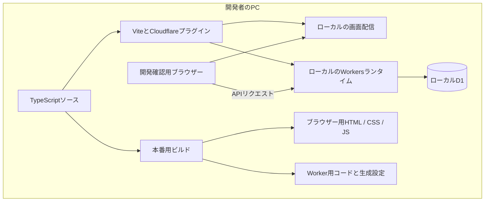
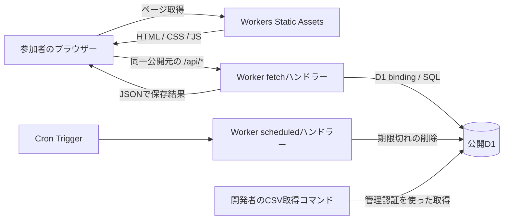

# アーキテクチャ

基準日: 2026-09-11。以下は目標構成です。実装適合性は未検証です。[受け入れ基準](acceptance-criteria.md)を併せて参照してください。サービスの料金・仕様は公開前に公式資料で再確認します。

## 採用方針

React + TypeScriptのSPAをViteでビルドし、Cloudflare WorkersのStatic Assetsで配信します。
同じ公開元の`/api/*`をWorkerのAPIで受け、D1へ保存します。
SSR、Next.js、生成AI、ORM、ユーザーログイン、独自の管理画面は初期実装に含めません。
APIは標準のRequest/Responseと小さなルーティング処理、DBはprepared statementで実装する案です。

選定理由は、React SPAとAPIの公式構成があり、画面・API・DBを一つのサービスで管理できることです [C1, C2]。
一方、Workerは常駐する汎用Node.jsサーバーとは異なる実行環境です。D1のbindingもサービス固有なので、この点は設計上の依存として明示します。
無料枠中心という要件と、サーバーの受信・検証・SQLをコードで示す要件を優先しました。

## どこで何が動くか

| 場所 | 動くもの | 主な役割 | 置かないもの |
| --- | --- | --- | --- |
| 開発者のPC | Node.js、npm、Vite、Wrangler、テスト、CSV取得スクリプト | 編集、依存導入、ビルド、公開、管理操作 | Gitに含める実回答・認証情報 |
| 参加者のブラウザー | ビルド後のJavaScript、React、jsPsych | 同意画面、刺激提示、入力、進捗、送信待ち | D1管理権限、CloudflareのAPIトークン |
| 公開Worker | APIのJavaScript、fetch/scheduledハンドラー | 受信検証、セッション管理、DB操作、期限切れ削除 | Reactの課題描画、参加者の反応時間計測 |
| 公開D1 | SQLデータベース | 参加セッションと試行回答の永続化 | 参加者のブラウザーからの直接接続 |

ブラウザーの時計・入力・保存内容は改変されうるため、サーバーでは別途検証します。
TypeScriptの型はビルド後の受信JSONを検証しません。APIに実行時の検証を実装します。

## ローカル開発とビルド



Cloudflare Viteプラグインを使い、開発中もWorker用コードを対応するランタイムで動かします [C1]。
ローカルD1は公開D1とは別のデータです [C2]。通常の開発コマンドでは公開DBへ接続しません。
ブラウザーのlocalStorageも公開元が異なるので、ローカルと公開サイトの進捗は共有されません [M1]。

ビルドはソースを配信用の成果物へ変換する工程であり、公開やDB作成ではありません。
プラグインが生成する成果物とWorker設定を公開に使用し、正確な出力先はP0の実機確認後にREADMEへ追記します。
`vite preview`などのローカル確認が通っても、公開環境でのAPI・binding・Cronの確認は別に行います。

## 公開後



- `/api/*`を静的配信のSPAフォールバックより優先します。APIの404で`index.html`を返さないようにします。
- APIはJSONを返し、回答・進捗APIには`Cache-Control: no-store`を付けます。
- `/`の配信と`/api/*`を同一公開元にし、別ドメイン間の通信設定を初期構成に持ち込みません。
- Workerはリクエストごとに必要な処理を行います。プロセスのメモリーに回答や参加状態を永続化しません。
- 公開後は開発者のPCを停止しても参加・保存できることを受入確認します。
- 初回はサービス提供の公開URLを使用する案とし、独自ドメインの購入は必要条件にしません。

## ReactとjsPsychの境界

Reactは説明・同意・再開確認・保存状況・完了画面を担当します。対応保証は検証時のChrome安定版とし、OSと版を検証記録に残します。表示幅1024 CSS px以上で、キーボードのみでも全操作を完遂できることを確認します。幅不足・Web LocksやlocalStorageなどの必須機能不足は開始前に案内します。Edge、Firefox、Safariは今回の動作保証対象外です。
課題中は専用DOM領域をjsPsychの`display_element`へ渡し、その内側のDOMをReactから書き換えません [J1]。

jsPsychは場面と質問の提示、回答の確定、試行時間を担当します。
`survey-likert`を第一候補とし、状況と提案を前文、2つの評価を必須質問にします [J2]。
プラグインの回答値が0始まりの場合は、境界で1〜7へ変換してから共通データ型に渡します。
Reactの再描画や保存状態の変化で、実行中のタイムラインを作り直しません。

試行の完了通知では、プラグイン固有の生データから必要項目を取り出し、ブラウザー保存と送信キューへ渡します。
jsPsychの全データをそのままAPIへ送る設計にはしません。
jsPsychの終了通知は「画面上の課題が終わった」ことを示し、DB保存や参加完了を意味しません。

ReactのStrictModeでは開発時にEffectのセットアップとクリーンアップが追加実行されます [R1]。
そのため、実行インスタンスの寿命と通知の有効性を管理し、古い実行からの通知を無視して、タイマー・イベントを片付けます。
単純な「一度だけ実行した」フラグで再セットアップを拒む実装や、StrictModeを無効にして二重起動を隠す方法を完成扱いにしません。

## フォルダー案

```text
src/
  app/               # Reactの画面と画面遷移
  experiment/        # jsPsychへの変換、実行領域、試行の正規化
  persistence/       # localStorage、送信待ち、再開、同時タブ制御
  styles/            # 参加者向けの落ち着いた実験UI
shared/
  study.ts           # バージョン付き固定刺激と条件定義
  contracts.ts       # APIと保存データの型・実行時検証
worker/
  index.ts           # API入口、scheduled入口
  sessions.ts        # 作成、認証、再開、完了
  trials.ts          # 逐次保存と重複判定
  retention.ts       # 保持期限の処理
migrations/          # D1スキーマ
scripts/             # CSV取得、合成データの検証補助
tests/               # API統合テストとブラウザーE2E
docs/                # この計画と実装後の運用手順
```

単一のnpmプロジェクトから開始します。ブラウザー・Worker・管理スクリプトのTypeScript設定を分け、Node専用モジュールをブラウザーへ混入させないようにします。
刺激の内容は公開情報です。ソースや通信を調べれば比較条件がわかる構成なので、条件の完全な秘匿は主張しません。

## 環境と設定

| 設定 | 配置と扱い |
| --- | --- |
| `DB` binding | ローカル、検証用公開、デモ公開で別DBを指定 |
| `STUDY_VERSION` / `CONSENT_VERSION` | コードに固定。保存行にも記録 |
| `COLLECTION_ENABLED` | Worker側。初期値は無効。停止しても既存の有効セッションの保存は許可する |
| `RESUME_TTL_HOURS=24` | サーバーを期限判定の基準とする |
| `DEMO_RETENTION_DAYS=30` | サーバー作成時刻から計算。最後の回答で延長しない |
| 責任者・連絡先・説明文 | 公開設定として用意。未設定なら受付を有効化しない |
| Cloudflare管理認証 | 開発者の認証環境のみ。ブラウザー用環境変数へ置かない |

Node、React、jsPsych、Vite、Wrangler等の正確なバージョンはP0で互換性を確認して固定し、lockfileと実行環境指定を保存します。
技術選定時点の「最新」という表現を将来の実行条件にしません。
初期案はjsPsych v8のAPIを基準とします [J1]。

## 費用と運用の見積もり

初回接続で設定取得1回、開始1回、試行保存4回なら、500名で約3,000 APIリクエストです。4件目の保存と同時に完了するため、別の完了要求はありません。
再開、再送、アセット配信、テスト、Cronなどは別に数えます。500名が同時接続する想定とは区別します。
基本データ行は500セッションと2,000試行ですが、DBの読み書き課金は行数そのものではなく、検索・索引更新・削除も含めて確認します。

この見積もりから無料枠中心を目指しますが、無料を保証しません。
確認時点のFreeプランはWorkersが1日100,000リクエスト、1回あたりCPU 10ms、D1が1日500万行読み取り・10万行書き込み、合計5GB保存です [C3, C4]。
CPU時間は通信の待ち時間そのものとは異なるため、リクエスト件数だけで判定せず、実際の処理も計測します。
P0と公開直前にWorkers/D1の公式料金・上限、同じアカウントの他用途の消費を確認します [C3, C4]。
公開前の合成データ検証は検証用DBへ実施し、CPU時間・読み書き量・失敗率を確認します。
有料プランへの自動的な移行は実装作業の既定手順にしません。

## 公式資料

2026-09-11に仕様確認の参照先として使用。実装時にも再確認します。

- C1: [Cloudflare: React SPA with an API](https://developers.cloudflare.com/workers/vite-plugin/tutorial/)
- C2: [D1: Local development](https://developers.cloudflare.com/d1/best-practices/local-development/)
- C3: [Workers pricing](https://developers.cloudflare.com/workers/platform/pricing/)
- C4: [D1 pricing](https://developers.cloudflare.com/d1/platform/pricing/)
- C5: [Cron Triggers](https://developers.cloudflare.com/workers/configuration/cron-triggers/)
- C6: [D1 Time Travel](https://developers.cloudflare.com/d1/reference/time-travel/)
- J1: [jsPsych v8 API](https://www.jspsych.org/v8/reference/jspsych/)
- J2: [survey-likert](https://www.jspsych.org/v8/plugins/survey-likert/)
- R1: [React StrictMode](https://react.dev/reference/react/StrictMode)
- M1: [MDN localStorage](https://developer.mozilla.org/en-US/docs/Web/API/Window/localStorage)
