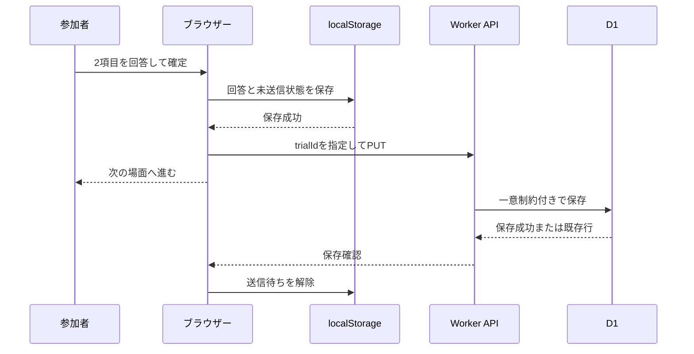

# データと再開の契約

実装予定のAPI・保存形式です。現時点でエンドポイント、DB、スクリプトは存在しません。
研究の流れは[研究計画](research-plan.md)、実行場所は[アーキテクチャ](architecture.md)を参照してください。

## 基本原則

1. 回答確定時にブラウザー内へ保存してから、次の場面へ進む。
2. APIへの送信は場面ごとに行い、未送信・送信中・保存確認済みを区別する。
3. 同じ回答の再送は同じ結果に収束し、異なる回答で既存行を上書きしない。
4. 全4場面をDBで確認できるまで参加完了にしない。
5. 24時間は開始からの再開・送信可能期限、30日はDB内の保持期限とする。再開で期限を延長しない。

## 参加IDと認証

参加IDはセッションごとのランダムUUIDとし、氏名、メール、募集サービスのIDは入力させません。
別に256ビットのランダムな再開トークンをブラウザーのWeb Cryptoで生成します。
IDだけでは回答を読み出せないよう、セッション作成を含むAPIでトークンをAuthorizationヘッダーに送ります。
D1にはトークンのSHA-256ハッシュだけを保存し、平文はブラウザー内の再開情報にのみ保持します。
トークンをURL、CSV、アプリログに含めません。ログインや本人確認を実装する仕組みではありません。

開始通信が失敗しても同じID・トークンで再送します。
新規作成時にだけサーバーで各50%の確率による独立した2群割り当てを行い、両群共通の4場面の順番を別にランダム化して保存します。人数を揃えるための調整は行いません。
同じIDでトークンが一致すれば、既存の割り当てと期限を返し、別のセッションを増やしません。同時作成の競合でも、DBに保存された群とmanifestを返し、呼び出しごとに異なる割り当てを返さないようにします。
IDが既存でもトークンが異なる場合は内容を返しません。

## API案

| メソッド / パス | 入力・用途 | 結果 |
| --- | --- | --- |
| `GET /api/config` | 説明文、現行バージョン、受付状態 | 公開情報のみ |
| `POST /api/sessions` | `session_id`, `study_version`, `consent_version`, `consent: true` とトークン | 作成時刻、期限、割り当て群（`acknowledge` / `neutral`）、4場面の順番、固定された刺激を含むmanifest |
| `GET /api/sessions/:id` | トークンで認証し進捗を照合 | manifest、保存済み回答、状態、サーバー時刻 |
| `PUT /api/sessions/:id/trials/:trialId` | 1場面の回答 | 保存済みのtrialId。新規201、同一再送200 |
| `POST /api/sessions/:id/complete` | 全課題終了の申告 | 全4件確認後に完了。同一再送も成功 |

`/api/*`の存在しないパスはJSONの404。すべてのAPI応答はキャッシュしません。
未同意の作成、旧版の新規開始、受付停止中の新規開始は拒否します。
サーバーはID、形式、JSONサイズ、尺度範囲、manifest内のtrialIdと場面・条件・順番の整合を検証します。
クライアントが自己申告した条件をDBの正として扱いません。
入力不備400、認証失敗401、内容の衝突409、有効な資格情報での期限切れ410、過負荷429、一時障害503を区別します。
無効トークンにはセッションの存否や回答を開示しません。

初期上限案は作成リクエスト4KiB、1試行8KiB。自由入力を許可せず、余分なキーも検出します。
サーバーはprepared statementとDB制約を併用します。

## データの形

APIとDBの時刻はUTC。保持期限と完了時刻はサーバーで決めます。

| テーブル | 主な列 | 制約・目的 |
| --- | --- | --- |
| `sessions` | `session_id`, `token_hash`, `study_version`, `consent_version`, `assigned_condition`, `manifest_json`, `created_at`, `resume_expires_at`, `delete_after`, `completed_at` | IDが主キー。assigned_conditionはacknowledge / neutralに限定し、群とmanifestは開始後変更しない |
| `trials` | `session_id`, `trial_id`, `scene_id`, `condition`, `presentation_index`, `understanding`, `usefulness`, `rt_ms`, `segment_id`, `segment_started_at`, `resume_count`, `presentation_attempt`, `client_answered_at`, `received_at`, `payload_hash` | `(session_id, trial_id)`が主キー。セッションへの外部キー、削除はCASCADE |

`trials`には`(session_id, presentation_index)`の一意制約、尺度値の1〜7チェックも付けます。
`delete_after`に索引を設け、期限切れ削除の全表走査を避けます。
状態は`completed_at`があれば完了、なければ途中とし、24時間経過後は期限切れの途中回答として扱います。
研究用の人物IDと実験セッションIDを二重に増やさず、今回のランダム参加IDは`session_id`に統一します。

`manifest_json`にはschema/studyバージョン、割り当て群（`assigned_condition`）、両群共通のS01〜S04の順番、trialId、条件、提示文と質問文を保存します。
4場面の条件はすべて`assigned_condition`と一致させ、APIで整合性を検証します。
これにより、24時間内に新しい版を公開しても、元の群・順番・提示文で再開できます。
少なくとも有効なセッションが存在する間は旧schemaの読み取りを維持します。対応できない変更では再開を止め、新旧回答を同一セッションに混ぜません。

回答DTOの概念例:

```ts
type TrialAnswer = {
  trialId: string;
  understanding: number; // 実行時にも1〜7の整数を検証する
  usefulness: number;
  rtMs: number;
  segmentId: string;
  segmentStartedAt: string;
  resumeCount: number;
  presentationAttempt: number;
  clientAnsweredAt: string;
};
```

場面・条件・表示位置はサーバーがmanifestから導出します。
`rt_ms`はその画面の提示から回答確定までで、純粋な判断速度ではありません。本文を読む時間も含みます。
`segment_id`はページの実行区間ごとに変え、`resume_count`は実際に途中再開するごとに増やします。
区間の開始時刻も回答のメタデータに含め、最初の回答以前の中断も記録できるようにします。
クライアント時計から求める中断時間は参考値であり、厳密な時計同期は実装しません。

## 逐次保存と重複防止



送信キューは1本に直列化します。完了登録は試行キューが空になってから行います。
一時的なオフラインでもローカル保存が成功していれば回答を続けられますが、完全オフラインでの新規開始・再開は保証しません。
再開時は先にAPIと照合し、サーバー未登録の回答を再送してから未回答の場面に進みます。

ネットワーク切断、429、5xxには間隔を空けた有限回の再送を行い、その後は「接続を確認して再送」を表示します。
429の待機指定があれば従います。400/401/409/410は自動再送し続けず、原因に合う画面へ移ります。
回答のローカル保存自体が失敗した場合は次の場面へ進めず、保存環境を確認する案内を出します。

重複処理では、回答DTOを定義済みの順序・形式に正規化してハッシュを比較します。
APIで新たに付けた受信時刻は比較に含めません。
同じ主キーかつ同じ内容なら成功を返し、異なる内容なら409として元の値を保持します。
並行リクエストでも一意制約とDB処理によって保証し、単純な「先にSELECTして存在しなければINSERT」だけに頼りません。
完了は、manifestに対応する全4件の存在を条件としたDB更新で確定します。

## 再開とローカル保存

保存キー例は`jspsych-demo:session:v1`。manifest、参加ID、トークン、回答、送信待ち、現在位置、区間情報、期限を一つのversion付きデータとして保持します。
ブラウザー内保存は端末に残るため、説明・同意画面で用途を伝えます。

| 状態 | 動作 |
| --- | --- |
| 24時間内の途中データあり | 回答を見せる前に「続きから再開 / この端末の進捗を消して新しく開始」を表示 |
| APIには保存済み、ローカルには未送信 | 回答内容が一致することを確認して送信待ちを解除 |
| API未保存、ローカルには確定回答あり | 元のtrialIdと内容のまま再送 |
| 両方に異なる確定回答あり | 上書きせず停止し、連絡先を案内 |
| 全回答済みで完了登録が未確認 | 完了APIを再送し、サーバー確認後に完了表示 |
| 作成から24時間経過 | 進捗を再開しない。期限切れデータを端末から消し、既存の途中回答はサーバーに残ることを説明 |
| 端末データが消去・破損 | 自動復旧を約束しない。新規開始する場合は別ID |
| 完了確認済み | 端末の回答・トークン・送信待ちを消去。次回は新規の説明画面 |

端末の保存データを消す操作はサーバーデータの削除ではありません。未送信回答は失われるため、実行前に明示します。
24時間を過ぎた時点で閉じているブラウザーの保存領域を消すことは保証できません。
アプリが動作している間の期限チェックと次回アクセス時に消去します。サーバー側は期限でアクセスを拒否します。
PCを共有する場合は、前の参加者の進捗が残りうるため、自動再開しません。

同じ参加IDの同時実行は1タブに限定します。Web Locksによる排他を第一案とし、ロック取得できないタブには利用中の案内を表示します。
対応ブラウザーでの動作をP0で検証し、非対応環境では実験開始を許可しない案内を出します。
別端末・別ブラウザーへの再開、進捗消去後の本人照合、ブラウザーによる保存領域の削除からの回復は対象外です。

## 30日保持と削除

`delete_after = created_at + 30日`をサーバーで設定します。
毎時のCronで期限切れのセッションを削除し、試行を外部キーで連動削除します。
30日到達時点からAPI・CSV取得の対象外とし、通常のDB削除は次の定期実行まで最大約1時間の遅延を見込みます。
Cron失敗時は次回も同じ処理を実行し、最終成功時刻と削除件数を運用で確認します。回答本文やトークンはログに出しません。

30日はアプリの稼働中DBでの利用・保持の方針です。
D1の復元履歴などには削除前の状態が一定期間残りえます。公式資料ではTime Travelは常時有効で、Freeプランは7日、Paidプランは30日の復元範囲があります [C6]。
物理的にすべてのコピーが30日ちょうどで消えるとは説明しません。
バックアップを復元した場合は受付再開前に期限切れ削除を再実行します。
Cloudflareのログ・保存地域・契約条件の確認は公開時の運用事項として残します。

## CSV取得

開発者のCloudflare管理認証とWranglerのD1問い合わせ機能を使用するスクリプトを作ります。
参加者用APIに全件取得や管理者パスワードを追加しません。
スクリプトのインターフェース案は`npm run data:export -- --target local|staging|demo --output <file>`です。現時点では実行できません。

既定では保持期限内の完了セッションのみを取得し、`--include-incomplete`で未完了も取得します。
1行1試行のUTF-8 CSVと、取得時刻・対象環境・抽出条件・schema版を記録した小さなメタデータファイルを出力します。
CSV列は参加ID、状態、study/consent版、割り当て群（`assigned_condition`）、場面、試行条件（群と一致）、順序、2評価、所要時間、区間・再開回数・再提示情報、各時刻です。
再開トークン・ハッシュ、内部設定、個人の連絡先は出力しません。
DBの結果上限を確認し、必要なら安定した主キーでページングして、取得件数とDB件数を照合します。

CSVはサーバー削除と連動しません。デモの実回答のコピーにも元の30日期限を適用し、取得者が削除を管理します。
テストやリポジトリに載せる分析例には合成データを使用します。出力フォルダー、ローカルDB、認証ファイルはGit対象外にします。

## 参照

- C6およびlocalStorageの仕様: [アーキテクチャの公式資料](architecture.md#公式資料)
- [Cloudflare D1 Wrangler commands](https://developers.cloudflare.com/workers/wrangler/commands/d1/)
- [MDN Web Locks API](https://developer.mozilla.org/en-US/docs/Web/API/Web_Locks_API)

アプリでは氏名やIPアドレスを回答テーブルへ保存しませんが、ホスティング基盤のアクセスログまで存在しないとは保証しません。
この設計を完全な匿名化や本人確認と呼ばず、ランダムIDによる回答管理として説明します。
