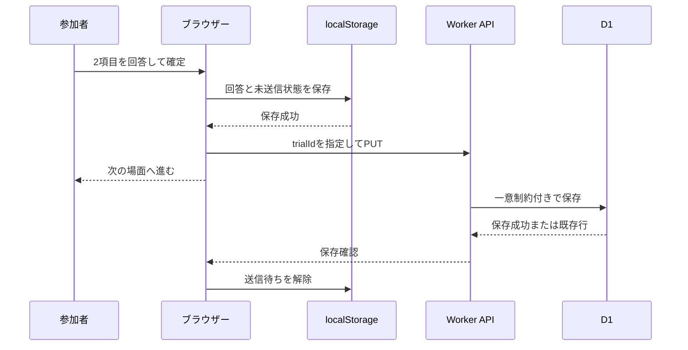

# データと再開の契約

目標とするAPI・保存形式です。作業ツリーには実装ファイルがありますが、この監査では実装適合性を検証していません。
2026-09-11の監査決定と合否判定は[受け入れ基準](acceptance-criteria.md)を参照してください。
研究の流れは[研究計画](research-plan.md)、実行場所は[アーキテクチャ](architecture.md)を参照してください。

## 基本原則

1. 回答確定時にブラウザー内へ保存してから、次の場面へ進む。
2. APIへの送信は場面ごとに行い、未送信・送信中・保存確認済みを区別する。
3. 同じ回答の再送は同じ結果に収束し、異なる回答で既存行を上書きしない。
4. 全4場面の保存と参加完了をDBで一体として確定する。別の完了要求は設けない。
5. 24時間は開始からの再開・送信可能期限、30日はDB内の保持期限とする。再開で期限を延長しない。

## 参加IDと認証

参加IDはセッションごとのランダムUUIDとし、氏名、メール、募集サービスのIDは入力させません。
別に256ビットのランダムな再開トークンをブラウザーのWeb Cryptoで生成します。
IDだけでは回答を読み出せないよう、セッション作成を含むAPIでトークンをAuthorizationヘッダーに送ります。
D1にはトークンのSHA-256ハッシュだけを保存し、平文はブラウザー内の再開情報にのみ保持します。
トークンをURL、CSV、アプリログに含めません。ログインや本人確認を実装する仕組みではありません。

開始要求の送信前にID・トークンをローカルに保存し、失敗時の手動再送でも同じ値を使います。ローカル保存に失敗した場合は開始要求を送りません。
新規作成時にだけサーバーで各50%の確率による独立した2群割り当てを行い、両群共通の4場面の順番を別にランダム化して保存します。人数を揃えるための調整は行いません。
同じIDでトークンが一致すれば、既存の割り当てと期限を返し、別のセッションを増やしません。同時作成の競合でも、DBに保存された群とmanifestを返し、呼び出しごとに異なる割り当てを返さないようにします。
IDが既存でもトークンが異なる場合は内容を返しません。

## API案

| メソッド / パス | 入力・用途 | 結果 |
| --- | --- | --- |
| `GET /api/config` | 説明文、現行バージョン、受付状態 | 公開情報のみ |
| `POST /api/sessions` | `session_id`, `study_version`, `consent_version`, `consent: true` とトークン | 作成時刻、期限、割り当て群（`acknowledge` / `neutral`）、4場面の順番、固定された刺激を含むmanifest |
| `GET /api/sessions/:id` | トークンで認証し進捗を照合 | manifest、保存済み回答、状態、サーバー時刻 |
| `PUT /api/sessions/:id/trials/:trialId` | 1場面の回答 | 保存済みのtrialIdとセッション状態。新規201、同一再送200。4件揃えば完了 |
`/api/*`の存在しないパスはJSONの404。すべてのAPI応答はキャッシュしません。
未同意の作成、旧版の新規開始、受付停止中の新規開始は拒否します。
サーバーはID、形式、JSONサイズ、尺度範囲、manifest内のtrialIdと場面・条件・順番の整合を検証します。
クライアントが自己申告した条件をDBの正として扱いません。
入力不備400、認証失敗401、内容の衝突409、有効な資格情報での期限切れ410、過負荷429、一時障害503を区別します。
無効トークンにはセッションの存否や回答を開示しません。
既存IDの開始再送は認証・期限の照合を行い、新規受付停止を理由に再作成・再抽選しません。期限判定はサーバー時刻が`resume_expires_at`未満なら有効、一致以降なら期限切れです。保持期限後に削除済みの場合は照合できず、期限切れ410の応答を保証しません。

初期上限案は作成リクエスト4KiB、1試行8KiB。自由入力を許可せず、余分なキーも検出します。
サーバーはprepared statementとDB制約を併用します。

## データの形

APIとDBの時刻はUTC。保持期限と完了時刻はサーバーで決めます。

| テーブル | 主な列 | 制約・目的 |
| --- | --- | --- |
| `sessions` | `session_id`, `token_hash`, `study_version`, `consent_version`, `assigned_condition`, `manifest_json`, `created_at`, `resume_expires_at`, `delete_after`, `completed_at` | IDが主キー。assigned_conditionはacknowledge / neutralに限定し、群とmanifestは開始後変更しない |
| `trials` | `session_id`, `trial_id`, `scene_id`, `condition`, `presentation_index`, `understanding`, `usefulness`, `rt_ms`, `segment_id`, `segment_started_at`, `resume_count`, `presentation_attempt`, `client_answered_at`, `received_at`, `payload_hash` | `(session_id, trial_id)`が主キー。セッションへの外部キー、削除はCASCADE |

`trials`には`(session_id, presentation_index)`の一意制約、尺度値の1〜7チェックも付けます。
`delete_after`に索引を設け、期限切れ削除の全表走査を避けます。
状態は`completed_at`があれば完了、なければ途中です。未完了セッションは24時間経過後に期限切れの途中回答として扱います。完了済みセッションは24時間後も分析上の完了状態を維持します。
研究用の人物IDと実験セッションIDを二重に増やさず、今回のランダム参加IDは`session_id`に統一します。

`manifest_json`にはschema/studyバージョン、割り当て群（`assigned_condition`）、両群共通のS01〜S04の順番、trialId、条件、提示文と質問文を保存します。
4場面の条件はすべて`assigned_condition`と一致させ、APIで整合性を検証します。
同じ仕様の運用中は、このmanifestで元の群・順番・提示文を再現します。参加途中に質問文・study/schema/consent版を変更する運用は、今回明示的に想定しません。更新をまたぐ再開、複数schemaへの互換対応、データ移行は受け入れ対象外です。これらが必要になった場合は別途仕様を決定します。

回答DTOの概念例:

```ts
type TrialAnswer = {
  trialId: string;
  understanding: number; // 実行時にも1〜7の整数を検証する
  usefulness: number;
  rtMs: number;
  segmentId: string;
  segmentStartedAt: string;
  resumeCount: number;
  presentationAttempt: number;
  clientAnsweredAt: string;
};
```

場面・条件・表示位置はサーバーがmanifestから導出します。
`rt_ms`はその画面の提示から回答確定までで、純粋な判断速度ではありません。本文を読む時間も含みます。
`segment_id`はページの実行区間ごとに変えます。`resume_count`は課題提示開始後の中断から、未確定場面の提示を再び開始するときに増やします。初回は0で、保存確認だけの再開・手動再送・単なる再開確認画面の表示では増やしません。
`presentation_attempt`は場面ごとの提示回数で初回1とし、未確定場面を再提示するときに増やします。提示開始の事実と回数をローカルに保存してから入力を許可し、最初の回答前のリロードでも再提示を判別できるようにします。確定済みDTOの回数・時刻・区間は再送で変更しません。
区間の開始時刻も回答のメタデータに含め、最初の回答以前の中断も記録できるようにします。
クライアント時計から求める中断時間は参考値であり、厳密な時計同期は実装しません。

## 逐次保存と重複防止



送信キューは1本に直列化します。最終回答の保存結果が完了を示すか、期限内の進捗照合で完了を確認できたら完了画面を表示します。
キューの先頭要求が失敗したら送信を停止し、後続回答が追加されても失敗した要求を自動再送しません。手動再送でキューを再び動かし、成功したら後続を順に送ります。再送ボタンの連打でも同じキューを複数起動しません。
一時的なオフラインでもローカル保存が成功していれば回答を続けられますが、完全オフラインでの新規開始・再開は保証しません。
再開時は先にAPIと照合します。サーバー未登録の確定回答があれば、参加者の手動再送で保存を確認してから未回答の場面に進みます。

自動再送は行いません。各要求は15秒でタイムアウトとし、通信切断・タイムアウト・429・5xxでは確定回答を保持して「接続を確認して再送」を表示します。タイムアウトはサーバーで保存されなかったことを意味しません。
参加者の手動操作で、同じID・トークン・確定DTOを使って再送します。429の有効な待機指定があれば、その時刻まで再送操作を無効にします。期限到達で送信を停止します。400/401/409/410は原因に合う画面へ移り、同じ入力の再送を案内しません。
回答のローカル保存自体が失敗した場合は次の場面へ進めず、保存環境を確認する案内を出します。

重複処理では、回答DTOを定義済みの順序・形式に正規化してハッシュを比較します。
APIで新たに付けた受信時刻は比較に含めません。
同じ主キーかつ同じ内容なら成功を返し、異なる内容なら409として元の値を保持します。
並行リクエストでも一意制約とDB処理によって保証し、単純な「先にSELECTして存在しなければINSERT」だけに頼りません。
試行保存と、manifestに対応する全4件の存在を条件とした`completed_at`の設定を、同じDBトランザクションで確定します。4件目だけが保存されて未完了となる状態を残しません。同一再送でも完了時刻を変更しません。別の完了APIは設けません。
最終保存の応答を失ってもDB上は完了データとして扱います。24時間内は照合または手動再送で画面表示を回復できますが、24時間以降は認証付き完了確認を含め410とし、確認用トークンの長期保持は行いません。画面で確認できなかったことを理由に、DBの完了状態を取り消しません。

## 再開とローカル保存

保存キー例は`jspsych-demo:session:v1`。manifest、参加ID、トークン、回答、送信待ち、現在位置、区間情報、期限を一つのversion付きデータとして保持します。
ブラウザー内保存は端末に残るため、説明・同意画面で用途を伝えます。

| 状態 | 動作 |
| --- | --- |
| 24時間内の途中データあり | 回答を見せる前に「続きから再開 / この端末の進捗を消して新しく開始」を表示 |
| APIには保存済み、ローカルには未送信 | 回答内容が一致することを確認して送信待ちを解除 |
| API未保存、ローカルには確定回答あり | 参加者の手動操作で元のtrialIdと内容のまま再送 |
| 両方に異なる確定回答あり | 上書きせず停止し、連絡先を案内 |
| 全回答確定済みで最終保存が未確認 | 期限内ならAPI照合し、完了済みなら完了表示。未保存なら参加者の手動再送を待つ |
| 作成から24時間経過 | 進捗を再開しない。回答・トークンを含む期限切れデータを端末から消し、保存済みデータはサーバーの保持期限まで残ることを説明。確認不能な場合は保存失敗とも完了とも断定しない |
| 端末データが消去・破損 | 自動復旧を約束しない。新規開始する場合は別ID |
| 完了確認済み | 端末の回答・トークン・送信待ちを消去。次回は新規の説明画面 |

端末の保存データを消す操作はサーバーデータの削除ではありません。未送信回答は失われるため、実行前に明示します。
24時間を過ぎた時点で閉じているブラウザーの保存領域を消すことは保証できません。
アプリが動作している間の期限チェックと次回アクセス時に消去します。サーバー側は期限でアクセスを拒否します。
PCを共有する場合は、前の参加者の進捗が残りうるため、自動再開しません。

同じ公開元の進捗保存領域を使用する実行は1タブに限定します。ID発行前から進捗の消去・新規開始まで同じ排他範囲に含め、別IDによる共有保存キーの上書きも防ぎます。Web Locksによる排他を第一案とし、ロック取得できないタブには利用中の案内を表示します。
対応ブラウザーでの動作をP0で検証し、非対応環境では実験開始を許可しない案内を出します。
別端末・別ブラウザーへの再開、進捗消去後の本人照合、ブラウザーによる保存領域の削除からの回復は対象外です。

## 30日保持と削除

`delete_after = created_at + 30日`をサーバーで設定します。
毎時のCronで期限切れのセッションを削除し、試行を外部キーで連動削除します。
30日到達時点からAPI・CSV取得の対象外とし、通常のDB削除は次の定期実行まで最大約1時間の遅延を見込みます。
Cron失敗時は次回も同じ処理を実行し、最終成功時刻と削除件数を運用で確認します。回答本文やトークンはログに出しません。

30日はアプリの稼働中DBでの利用・保持の方針です。
D1の復元履歴などには削除前の状態が一定期間残りえます。公式資料ではTime Travelは常時有効で、Freeプランは7日、Paidプランは30日の復元範囲があります [C6]。
物理的にすべてのコピーが30日ちょうどで消えるとは説明しません。
バックアップを復元した場合は受付再開前に期限切れ削除を再実行します。
Cloudflareのログ・保存地域・契約条件の確認は公開時の運用事項として残します。

## CSV取得

開発者のCloudflare管理認証とWranglerのD1問い合わせ機能を使用するスクリプトを作ります。
参加者用APIに全件取得や管理者パスワードを追加しません。
スクリプトのインターフェース案は`npm run data:export -- --target local|staging|demo --output <file>`です。現時点では実行できません。

試行CSVは既定では保持期限内の完了セッションのみを取得し、`--include-incomplete`で未完了の試行も取得します。
別に、保持期限内の全セッションを1行1セッションで出力するセッションCSVを常に添付します。0回答も含め、参加ID、study/consent/schema版、割り当て群、開始・再開期限・削除期限・完了時刻、保存済み試行数、状態を出力します。状態は完了、期限内未完了、期限切れ未完了を区別します。
両CSVはUTF-8とし、取得時刻・対象環境・抽出条件・schema版・各件数を記録したメタデータファイルを出力します。セッションCSVの未完了者を主要分析に混ぜません。
試行CSV列は参加ID、状態、study/consent/schema版、割り当て群（`assigned_condition`）、場面、試行条件（群と一致）、順序、2評価、所要時間、区間・再開回数・再提示情報、各時刻です。
再開トークン・ハッシュ、内部設定、個人の連絡先は出力しません。
DBの結果上限を確認し、必要なら安定した主キーでページングして、取得件数とDB件数を照合します。今回の受け入れ試験は回答追加のない固定した合成データで実施し、取得開始時刻を保持期限の抽出基準として全ページで固定します。募集と同時進行の厳密なスナップショット取得は保証対象外です。

CSVはサーバー削除と連動しません。デモの実回答のコピーにも元の30日期限を適用し、取得者が削除を管理します。
テストやリポジトリに載せる分析例には合成データを使用します。出力フォルダー、ローカルDB、認証ファイルはGit対象外にします。

## 参照

- C6およびlocalStorageの仕様: [アーキテクチャの公式資料](architecture.md#公式資料)
- [Cloudflare D1 Wrangler commands](https://developers.cloudflare.com/workers/wrangler/commands/d1/)
- [MDN Web Locks API](https://developer.mozilla.org/en-US/docs/Web/API/Web_Locks_API)

アプリでは氏名やIPアドレスを回答テーブルへ保存しませんが、ホスティング基盤のアクセスログまで存在しないとは保証しません。
この設計を完全な匿名化や本人確認と呼ばず、ランダムIDによる回答管理として説明します。
