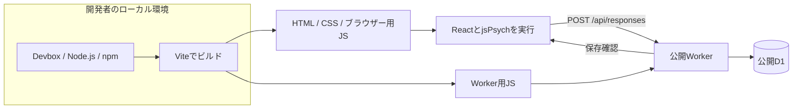

# Hello Worldの開発・デプロイ手順

この文書はコミット `7cf91b6` 時点の履歴です。現行のコードとコマンドは[実験デモの運用手順](study-deployment.md)を使用してください。ここにある旧デプロイ・DBコマンドを現行作業ツリーの手順として実行しないでください。

実装・公開の確認日: 2026-09-11 JST。
これは実装済みの接続確認用デモの手順です。研究計画の実装全体が完成したことを意味しません。

## 公開環境

| 項目 | 値 |
| --- | --- |
| URL | <https://jspsych-demo-hello.jspsych-demo.workers.dev/> |
| ヘルスチェック | <https://jspsych-demo-hello.jspsych-demo.workers.dev/api/health> |
| Worker | `jspsych-demo-hello` |
| D1 | `jspsych-demo-hello-db` |
| D1 binding | `DB` |
| D1 ID | `4e3ba16b-b78f-44a5-84e1-f96758e15b27` |
| 初回公開版 | `c5d2e7a0-f341-47ca-9aa0-09ab8ab8ba5c` |
| 定期実行 | `17 * * * *`。毎時17分に期限切れ回答を削除 |

この作業で新しいWorker、D1、`jspsych-demo.workers.dev`サブドメインを作成しました。
有料プランへの変更や独自ドメインの購入は行っていません。

## 実装範囲

- Reactで開始・接続状況・送信待ち・エラー・完了画面を表示。
- jsPsychの`html-button-response`で1試行を実行。
- ランダムUUID、固定の回答`hello`、反応時間を保存。
- WorkerがJSONと値を検証し、D1へprepared statementで書き込む。
- 同じ回答の再送は重複登録しない。既存IDに異なる内容を送った場合は409。
- 通信失敗時は同じ回答の再送ボタンを出す。保存を確認するまで完了にしない。
- DBに保存期限を設け、30日を経過した行を定期削除。

研究用の条件割り当て、4場面、同意文の最終稿、尺度評価、24時間の途中再開、CSV専用コマンドは未実装です。
Hello Worldの送信待ち回答はページのメモリーにのみ保持し、再読み込みやタブを閉じると失われます。
研究計画は別workerによる変更を反映して被験者間条件となっていますが、このHello World自体には比較条件がありません。

## 実行場所の違い



ローカルの`devbox run dev`ではCloudflare ViteプラグインがWorkerの開発ランタイムを起動します。
ローカルD1は`.wrangler/`以下へ保存され、公開D1へ書き込む設定にはしていません。
公開後の実行には開発者のPCやDevboxは不要です。

## 固定した環境

| ツール | 確認済みバージョン |
| --- | --- |
| Devbox | 0.18.0 |
| Node.js | 24.12.0。`devbox.lock`で固定 |
| React / React DOM | 19.3.0 |
| jsPsych | 8.3.0 |
| html-button-response | 2.1.0 |
| TypeScript | 7.0.2 |
| Vite | 8.3.0 |
| Cloudflare Viteプラグイン | 1.54.7 |
| Wrangler | 4.131.0 |

`devbox.json`と`devbox.lock`でNode.js環境を、`package.json`と`package-lock.json`でnpm依存を管理します。
検証した開発環境はmacOS / Apple Siliconです。
システムに別版のNode.jsがある場合も、以下のコマンドをDevbox経由で実行してください。

## 初回セットアップとローカル起動

前提: DevboxとNixが利用可能であること。

```sh
devbox install
devbox run setup
devbox run dev
```

`setup`は`npm ci`とローカルD1のマイグレーションを実行します。
`dev`は通常`http://127.0.0.1:5173/`で起動します。ポートが使用中の場合はログに表示されたURLを使用してください。
認証なしでもローカルの開発と保存を確認できます。

```sh
devbox run check
devbox run build
```

`check`は3つのTypeScript設定のチェックと入力検証テストを実行します。
`build`は型チェック後に公開用の成果物を生成します。

| 出力 | 内容 |
| --- | --- |
| `dist/client/` | HTML、CSS、ブラウザー用JavaScript、静的ファイル |
| `dist/jspsych_demo_hello/` | Worker用コードと生成されたWrangler設定 |
| `.wrangler/deploy/config.json` | 生成設定を使って公開するための参照情報 |

`dist/`と`.wrangler/`は生成物で、Gitには含めません。
正しい出力構成を保つため、生成ファイルを直接編集せず、ソースと`wrangler.jsonc`を変更して再ビルドします。

## Cloudflareへの再デプロイ

初回の認証が必要な環境では、次を実行してブラウザーで認可します。

```sh
devbox run -- npx wrangler login
devbox run -- npx wrangler whoami
```

現在のプロジェクトには公開D1のIDを設定済みです。
新しいマイグレーションがある場合は公開DBへ適用してから、アプリを公開します。

```sh
devbox run -- npm run db:migrate:remote
devbox run deploy
```

`deploy`はビルド後に`wrangler deploy`を実行します。新しいマイグレーションの適用は別操作です。
認証情報はWranglerの管理領域に保持され、コードやブラウザー用環境変数には入れていません。
別アカウントで使う場合は、そのアカウント用D1を作成し、`wrangler.jsonc`の名前・ID・Worker名を設定し直します。
現在のDBを削除・初期化するコマンドはセットアップや公開に含めていません。

初回はworkers.devの登録直後にTLS接続の準備が間に合わない場合がありました。
今回も数分後に通常のHTTPSで接続できることを確認しました。TLS検証を無効にする設定は使用していません。

## APIとDB

| API | 動作 |
| --- | --- |
| `GET /api/health` | 実際のテーブルへ問い合わせ、DB接続を確認する |
| `POST /api/responses` | `id`, `response`, `rtMs`を受け取り、保存した内容と時刻を返す |

新規保存は201、同一内容の再送は200、同じIDで内容が異なる場合は409です。
不正JSON・不正な値は400、サイズ超過は413、JSON以外は415です。
別の公開元からのブラウザー送信は403、DB障害は503として扱います。
存在しないAPIはJSONの404となり、SPAのHTMLへフォールバックしません。
回答一覧を取得できる公開APIはありません。

保存データを開発者が確認する場合:

```sh
devbox run -- npx wrangler d1 execute DB --local --command "SELECT id, response, rt_ms, saved_at FROM hello_responses ORDER BY saved_at DESC LIMIT 10;" --json
devbox run -- npx wrangler d1 execute DB --remote --command "SELECT id, response, rt_ms, saved_at FROM hello_responses ORDER BY saved_at DESC LIMIT 10;" --json
```

`--local`と`--remote`を区別してください。現在の実装では研究用のCSV専用コマンドはまだありません。
運用で行う抽出は`delete_after > unixepoch()`も条件に指定し、保持期限を過ぎた行を取得しないようにします。

30日はアクティブDBの保持方針です。削除は毎時の処理となり、復元履歴や取得済みのコピーからも30日ちょうどに消えることを保証するものではありません。
初期の接続確認で保存した合成回答も、同じ保持期限で削除されます。

## 検証方法と結果

APIのスモークテストは、起動済みローカルまたは公開URLを明示して実行します。
実行ごとに合成回答を1件保存します。

```sh
devbox run -- npm run smoke -- http://127.0.0.1:5173
devbox run -- npm run smoke -- https://jspsych-demo-hello.jspsych-demo.workers.dev
```

実施済み:

- Devbox環境で型チェック、入力検証の3テスト、本番ビルドが成功。
- `devbox run setup`でlockfileからの依存導入とローカルDB準備を再現できることを確認。
- ローカル・公開APIで、DB接続、ルーティング、入力値、Content-Type、本文サイズ、Originを検証。
- 同じ回答の同時送信が201/200となり、異なる内容の再送を409で拒否することを確認。
- ブラウザーでjsPsych試行から保存完了まで操作し、公開D1への保存を確認。
- ローカルの通信を503に置き換え、再送操作から保存完了へ進めることを確認。
- ローカルに期限切れのテスト行を作り、scheduledハンドラーの実行後にその行がなくなることを確認。
- 公開画面を1280pxと390px幅で確認。公開ページのブラウザーコンソールにエラー・警告なし。
- ローカル開発サーバーを停止後も、公開APIがD1へ接続できることを確認。

これらはHello Worldの確認であり、100〜500名の研究運用・被験者間割り当て・途中再開の検証ではありません。

## 主なファイル

- `devbox.json`, `devbox.lock`: 開発ツールの環境。
- `src/App.tsx`: Reactの画面と保存状態。
- `src/HelloTrial.tsx`: jsPsychの起動・終了とReactとの境界。
- `shared/contracts.ts`: データの型と実行時検証。
- `worker/index.ts`: APIと期限切れ削除。
- `migrations/0001_hello.sql`: テーブルと一意制約。
- `wrangler.jsonc`: Worker、D1 binding、配信、定期実行。
- `scripts/smoke-test.ts`, `tests/contracts.test.ts`: APIの実接続検証と入力検証。

jsPsychの全CSSに含まれる埋め込みフォントは読み込まず、必要なレイアウトを`src/styles.css`で定義しています。
現在のCSS成果物は約6KBで、外部フォント配信サービスへの接続はありません。
