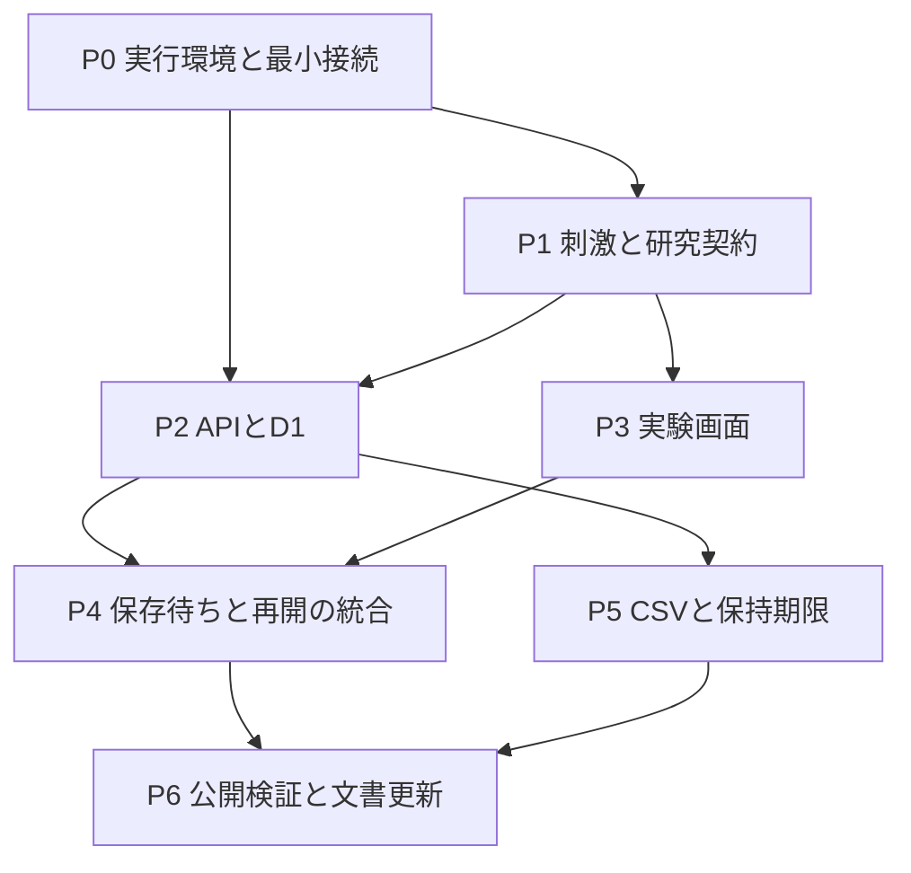

# 実装計画

基準日: 2026-09-11。質問への回答を反映した目標計画です。作業ツリーに実装ファイルはありますが、各段階の適合性・完了状態は未検証です。
この文書のコマンド名は目標インターフェースであり、存在・動作の保証ではありません。2026-09-11の監査決定と具体的な合否判定は[受け入れ基準](acceptance-criteria.md)を参照してください。

## 完成するもの

- 約5分の日本語ウェブ実験。説明・同意、4場面の課題、保存確認、簡素な完了画面。
- React/jsPsychをブラウザーで実行し、Workers APIで検証してD1へ保存する実装。
- 場面ごとの保存成功後に次へ進む逐次保存、通信失敗時の手動再送、同じブラウザーから24時間以内の再開。
- デモデータの30日保持と期限切れ削除。
- 開発者向けのCSV取得コマンド、ローカル起動・ビルド・公開・運用の説明。
- 完了・途中・0回答・期限切れを含む少数の合成データによる保存・取得の検証。

講演用スライド、進行台本、サイト内のコード解説、結果比較画面、生成AI、管理画面、募集・謝礼システムは作りません。
質問に回答していただいた範囲を越えるサービス契約や実参加者の募集は、この計画の保存によって実施したことにはなりません。

## 要件と設計案の区別

| 区分 | 内容 |
| --- | --- |
| ユーザーが決定 | 題材、理解を示す一言の比較、被験者間2群への各50%の単純無作為割り当て、1人4場面、固定文章、指定された希望、約5分、2尺度、PC向け、逐次送信、Workers+D1、TypeScript、ランダムID、CSV、24時間再開、30日保持 |
| 監査・再精査で決定 | 4回答保存で自動完了、手動再送のみ・15秒待機、完了試行・未完了試行・全セッション・抽出メタデータの4ファイル固定出力、詳細な再開記録を維持、Chromeのみ、少数の代表例で整合性確認、途中更新は想定外、公開は正常系・通常再開・Cron設定を確認 |
| 本計画で具体化した案 | 両群共通のS01〜S04、場面順のランダム化、7段階の質問文、APIとDB、全文保存する開始時manifest（提示文・質問文の正本管理は行わず分析時に文字列照合）、最大1場面のローカル送信待ち、再開トークン、毎時削除、フォルダーと段階分け |
| 研究実施前に未確定 | 責任者・連絡先、参加条件、募集方法、同意文、刺激の最終稿、必要人数、分析・除外規則 |

研究実施前の未確定事項は、技術的な実装の着手を妨げるものではありません。
仮の研究者情報を実情報のように公開せず、ローカルと合成データ用の公開Worker/D1の1組で画面と保存を検証します。公開デモの用途を明示し、実参加者の収集開始と扱いません。実参加者の収集を始める前に、研究準備と検証用データとの環境分離を行います。合成データ用デモは新規開始を受け付け、新規受付停止・既存参加継続の制御と研究者情報の未設定時の受付制御は実収集前へ延期します。

## 依存関係

P1でAPI型とmanifestの契約を固めた後、P2とP3は独立して進められます。
これは作業の依存関係を示す図であり、Subworker/Reviewerの利用を前提とする計画ではありません。

## P0: プロジェクトと実行環境

作業:

- React + TypeScript + Vite + Cloudflare Viteプラグインを単一プロジェクトで構成する。
- jsPsych v8系と使用プラグインの互換版、Nodeの対応版を確認し、依存とlockfileを固定する。
- ブラウザー、Worker、スクリプトの型チェック範囲を分ける。
- ローカルD1へ接続し、合成データ1件の受信・検証・保存を確認する。
- 静的ページと`/api/*`のルーティングを確認する。APIの404でHTMLが返らないようにする。
- Chrome安定版のみを動作保証対象とし、通常のPC幅とキーボード操作を確認する。OS・版・検証した幅を一括記録に残す。固定幅による開始禁止は設けず、小画面にはPC利用を、必須機能不足には開始前の案内を出す。
- Web LocksとlocalStorageの利用可否、画面幅、キーボード操作を確認する。
- Workers/D1の無料枠と制限、正確な公開・マイグレーション手順を公式資料で再確認する。

予定ファイル: `package.json`, lockfile, TypeScript設定, `vite.config.ts`, `wrangler.jsonc`, `worker/index.ts`, 初期マイグレーション, `.gitignore`。

完了条件:

- 新規チェックアウトで依存を導入し、ローカル画面・API・ローカルD1の接続を再現できる。
- ビルドしたブラウザー成果物にDB管理認証が入らない。
- ローカル起動が公開DBへ接続しない。
- 実装したスクリプトだけをREADMEに実行可能として掲載する。

## P1: 刺激と研究契約

作業:

- 4場面の状況、2種類の前置き、共通の提案本文を作成する。
- 提案が希望に適合するか確認する。4場面の全文を固定し、場面内の提案本文一致、前置きの文数・敬体統一を目視確認する。文字数比較表は研究準備の任意作業とし、文字数差の上限や操作の効果の証明は合格条件にしない。
- 2尺度、参加者単位の固定条件、各50%の独立した群割り当て、ランダム順、study/schema/consent版を定義する。
- 場面の全文と割り当てを含むmanifest（提示文・質問文の正本管理は行わず、分析時に文字列を照合）、試行DTO、API応答の型と実行時検証を確定する。
- 説明・同意文の構造を用意する。研究者情報の未設定による受付制御は実収集前へ延期する。未確定の責任者情報を埋めるための代替人物名は作らない。

予定ファイル: `shared/study.ts`, `shared/contracts.ts`, `docs/research-plan.md`。

完了条件:

- 各参加者の4場面に重複がなく、すべてセッションの割り当て条件になる。
- 両群が共通のS01〜S04を評価し、提案本文は場面内で一致する。群人数を揃える処理は設けない。
- 群と順列はmanifestとして保存・再利用でき、開始の再送・同時作成・再開時に割り当てが変わらない。
- 初期の文案と研究実施用の確定版が区別されている。

## P2: APIとD1

作業:

- セッション、試行、索引、一意制約、外部キーをマイグレーションで作成する。
- 設定取得、セッション作成・照合、試行PUTを実装する。4件目の保存と完了更新は同じDBトランザクションで確定する。
- トークンのハッシュ照合、入力検証、バージョン・期限・manifest照合を実装する。
- 同一リクエストの再送を許可し、異なる回答の上書きを拒否する。
- 今回の合成データ用デモでは新規作成を受け付ける。新規受付のみを停止し既存参加の保存を継続する制御は、実収集前に整備する。

予定ファイル: `worker/sessions.ts`, `worker/trials.ts`, `migrations/`, API統合テスト。

完了条件:

- 未同意、不正尺度値、未登録場面、不正トークン、異なるmanifestを受理しない。
- 同時に同じ試行を再送しても1行だけ保存される。
- 内容が異なる再送は409となり、元の回答が残る。
- 3場面では完了せず、4場面の保存で自動完了する。最終保存の同一再送でも完了時刻は変わらず、応答消失でもDBの完了は維持される。
- ローカルD1を使う統合テストでDB制約を確認する。DBをすべてモックして完了扱いにしない。

## P3: 実験画面

作業:

- 説明・同意・課題・保存待ち・完了・期限切れ・再開確認をReactで実装する。
- 専用領域でjsPsychを動かし、2尺度が入力されたら試行DTOへ変換する。
- 1〜7の値を正しく保存し、未選択を既定値として扱わない。
- PC向けの読みやすい幅と文字サイズ、フォーカス、キーボード操作、エラー表示を整える。
- 小画面や対象外端末にはPCでの参加案内を出す。数値だけを極端に縮小して操作可能と扱わない。
- 条件名、仮説、保存用のトークン、技術的なエラー詳細を参加者に見せない。

予定ファイル: `src/app/`, `src/experiment/`, `src/styles/`。

完了条件:

- 実験参加者として説明から完了まで一通り操作できる。
- ReactのStrictMode下でも二重開始・二重送信や入力の消失が起きない。
- 画面遷移で前のjsPsych実行のイベントやタイマーが残らない。
- 個人結果、全体集計、技術解説のページが実験フローに混入しない。

## P4: 保存待ちと再開の統合

作業:

- 確定回答・manifest・最大1場面の送信待ちをlocalStorageへ保存する。各場面のDB保存成功後に次へ進み、後続場面をためるキューは設けない。
- 手動再送、API照合、再開確認、24時間期限、同時タブ制御を実装する。自動再送は行わない。
- ネットワーク障害後も同じtrialIdで送り直し、未確定の場面だけを再提示する。
- 端末データを消す操作とサーバー削除が別であることをUIに示す。
- 全件の保存による完了状態が確認できるまで「実験完了」を表示しない。

予定ファイル: `src/persistence/`, 保存・重複・期限などの重要箇所の自動テスト。画面の再開・通信障害は手動確認も可とし、ブラウザー自動化は必須にしない。

完了条件:

- 再読み込み、タブを閉じて開き直す操作で、同じ割り当てと回答が保たれる。
- 送信がDBへ届いた直後に応答を失っても、再開時に重複しない。
- APIが落ちている間は保存済みと表示せず、復旧後に手動操作で残りを送信できる。
- 24時間を超えた進捗は再開せず、クライアント時計の変更だけでサーバー期限を延ばせない。
- 未確定場面の再提示が記録され、確定済み場面の再回答を求めない。課題再開と保存確認だけの再開を区別し、確定DTOは再送で変更しない。
- 単一タブ制御は維持する。代表例として2つ目のタブが開始・進捗変更できず、元のタブを閉じた後に再開できることを確認する。開始前・途中・進捗消去ごとの独立した競合試験は要求しない。
- 完了後はブラウザーの回答とトークンを消す。

## P5: CSVと保持期限

作業:

- 開発者の管理認証でD1から取得するCSVスクリプトを実装する。
- 完了試行CSV・未完了試行CSV・全セッションCSV・抽出メタデータを毎回固定出力する。抽出オプションは設けず、空のCSVにもヘッダーを出す。セッションCSVには0回答も含める。試行CSVには文字列照合用の提示文・質問文の全文も出力する。
- 毎時の期限切れ削除と、削除の合成データ検証を実装する。
- DBとCSVの行数照合、抽出条件のメタデータ記録を実装する。
- CSV、ローカルDB、認証ファイルをGitから除外する。

予定ファイル: `scripts/export-data.ts`, `worker/retention.ts`, 保持期限テスト。

完了条件:

- 両群の完了者、0回答・1〜3回答・期限切れ・保持期限切れを含む少数の固定した合成データを用意し、3種のCSVの値・対象・件数をDBと照合する。500件規模の取得確認は将来の運用前に行い、今回の完成条件には含めない。同時500名や応答速度の保証は含めない。
- 未完了、保持期限切れ、別環境の回答が完了試行CSVに混ざらない。24時間経過後も30日の保持期限内であれば、完了セッションは取得する。
- トークンやハッシュをCSVに出さない。
- 作成から30日の境界を試験用の時計で検証し、親子の行が連動削除される。
- 削除の失敗後に再実行できる。バックアップ復元の試験は対象外とし、復元時には受付再開前に期限切れ削除を再実行する旨を運用手順に残す。

## P6: 公開検証と文書更新

作業:

- ローカルと合成データ用公開のWorker/D1設定の対応を文書化する。公開Worker/D1は1組で完成可とする。
- ローカルと公開のマイグレーション、ビルド、公開、CSV取得を新規環境で確認する。
- 合成データ用公開環境で正常な保存・取得・途中再開とCron設定を確認する。障害・期限削除はローカルで検証し、公開Cronの実行成功確認は公開後の運用確認とする。
- 5〜10名の予備実施が可能になった段階で、説明と時間を確認する。未実施なら残件として報告する。
- 実装の正確なファイル・コマンド・バージョンに合わせてREADMEと各設計文書を更新する。

完了条件:

- 公開URLで、同意から保存確認済みの完了まで実行できる。
- 開発者のPCを停止してもサイトと回答保存が動く。
- 公開環境のDBへ到達した回答をCSVで確認できる。
- ブラウザーとAPIに重大なエラーがなく、ローカルで通信障害・期限削除、公開で正常系・通常の再開・Cron設定を確認している。
- 実参加者の受付は研究上の確認事項と環境分離を満たしてから有効にする。合成データ用デモの技術完成と実参加者の募集可能性を区別して報告する。

## 予定コマンド

次のインターフェースを目標とします。実装時に公式ツールの構成に合わせて確定します。

| 予定 | 役割 |
| --- | --- |
| `npm run dev` | ローカルの画面・Workerを起動 |
| `npm run typecheck` | ブラウザー・Worker・管理スクリプトの型確認 |
| `npm run build` | ブラウザー用とWorker用の公開成果物を生成 |
| `npm test` | 割り当て、API、DB、期限の検証 |
| `npm run test:e2e` | 任意。画面確認を自動化する場合の参加フローと通信障害・再開の検証 |
| `npm run db:migrate:local` | ローカルD1へスキーマ適用 |
| `npm run db:migrate:demo` | 合成データ用公開D1へスキーマ適用 |
| `npm run deploy:demo` | 合成データ用環境へ公開 |
| `npm run data:export -- --target local --output <file>` | 環境を明示してCSV取得 |

マイグレーションと公開はビルドとは別の操作です。
公開環境の指定を省略した場合に、本番相当の環境へ自動接続しないようにします。
参加途中の仕様変更・更新をまたぐ再開・複数schema互換性・移行は今回明示的に想定しません。同じ版の運用における再開を検証します。

## 必須の検証ケース

| 領域 | 確認する振る舞い |
| --- | --- |
| 割り当て | 各50%の独立した2群割り当て、全4場面が同一条件、両群共通の場面、開始再送・同時作成・再開で群と順番固定 |
| 入力 | 2回答必須、尺度の1〜7変換、サーバーでも範囲検証 |
| 保存 | 通常送信、再送、同時重複、異なる内容の衝突 |
| 再開 | リロード、タブ閉鎖、途中場面、送信応答消失、別タブの代表例 |
| 期限 | 24時間直前・直後、30日直前・直後、クライアント時計のずれ |
| 完了 | 4件保存と完了の一体化、最終保存の応答消失・手動再送、完了後のローカル消去 |
| データ | 4ファイル固定出力、0回答を含むセッションCSV、未完了の分離と提示文・質問文の全文出力、少数の代表例の取得、token非出力、ローカルと公開の分離 |
| 実行場所 | ローカルDBの分離、静的成果物、公開Worker、開発PC停止後の動作 |
| バージョン | 同じ版の運用中はmanifest維持。途中の仕様更新は想定外 |
| UI | キーボード、フォーカス、読める幅、対象外端末案内 |

動作を伴わない文書の変更に対してアプリのテストが通ったとは報告しません。
実装時はこれらの重要な境界を検証し、DOMの細部や実装をなぞるだけのテストを増やさない方針です。
保存・重複・期限などの重要箇所は自動テストで確認し、画面操作は手動の通し確認も可とします。対象コミット・環境・実施日・結果は一括記録とし、各項目の独立した証拠資料は要求しません。

## 残る制約

ランダム参加IDは本人確認ではなく、重複参加や自動送信を完全には防ぎません。
ブラウザー保存の消去・共用、サービスの障害・無料枠超過、DB復元履歴やCSVコピーも運用上の制約です。
今回の完成条件は小規模デモの実装であり、無制限の公開募集を運用できる保証ではありません。
外部募集でこれらへの対策が必要になった場合は、募集方式・本人照合・アクセス制御を別の要件として具体化します。
